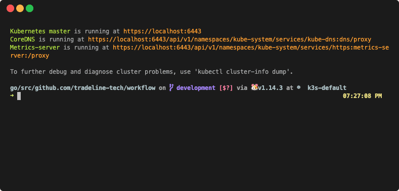

# _remote_ workflows

Run your distributed tasks fluently over gRPC asynchronous streaming goodness. :traffic_light:

## Why?
Because running asynchronous distributed activities as a cohesive linear workflow is hard.

## Features
* Define your _distributed_ tasks *sequentially* running 100% pure undomesticated Go.

* Live, cross-task declarative messaging, and configuration updates.

* Monitor your remote tasks' progress centrally.

* Because hiccups happen, resume your workflow activities where you left off.

* _where the rubber hit the road_, tech borne-out from demanding network deployment conditions.

## Use Cases
* Distributed Docker, K8s deployments.

* Remote Batch Processing.

* Remote Service Provisioning.

* Data provenance and analysis.

* Any loosely-coupled server to remote activities.

## Examples
* _~Guess~_[Hack the shared (Diffie-Hellman) secret.](https://github.com/tradeline-tech/workflow/tree/development/examples/secret) (_crack the secret exchanging algorithm with your coding add-on, and we will feature your solution_).

* Distributed Containers deployment.

* Remote Tic-tac-toe play.

## Steps to create a workflow
1. Declare your tasks _sequentially_.

  _Optionally, declare a Mongo connection._

2. Start the gRPC server,

3. Start your remote client to **run** your workflow :)

## Installation

`go get github.com/tradeline-tech/workflow`

## An inside look at the mechanics

